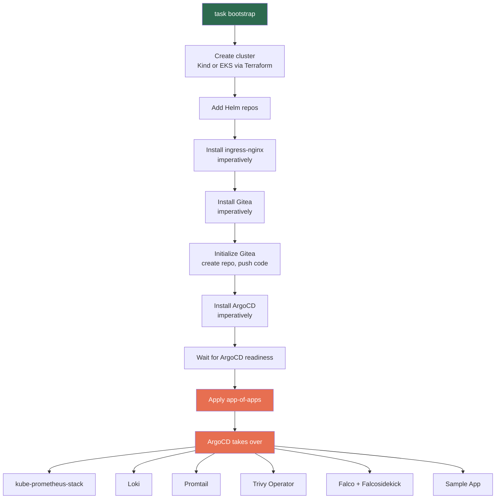
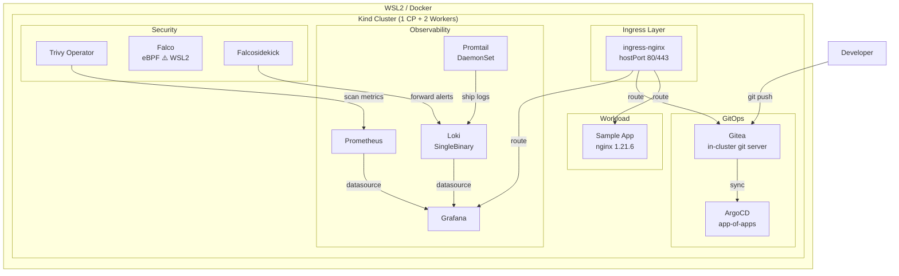
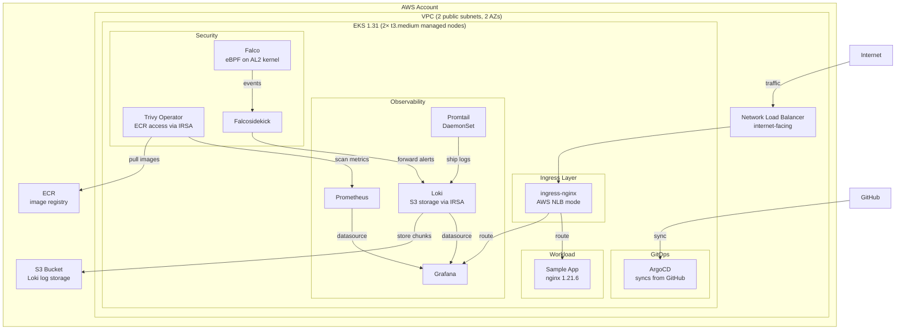
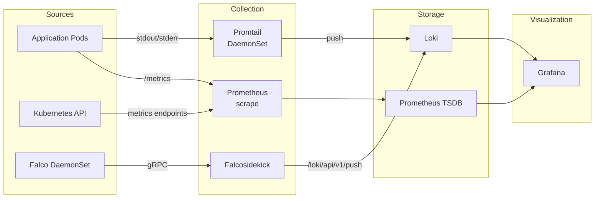
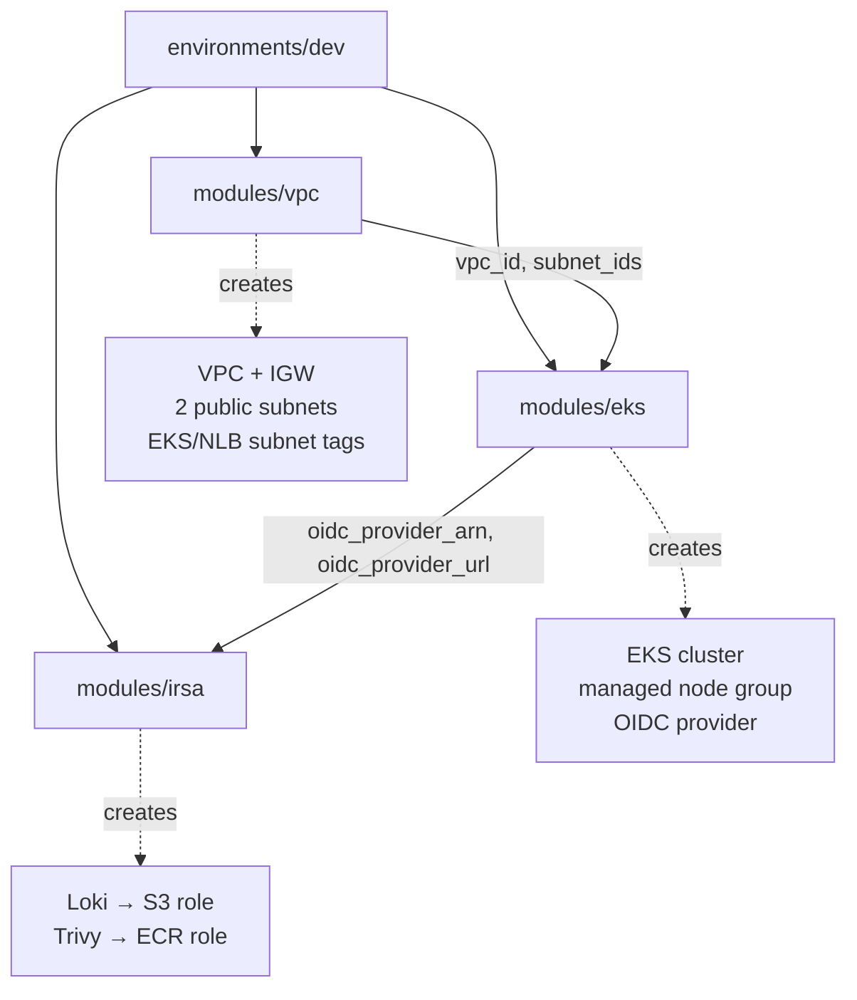

# Architecture

This document describes the platform architecture for both the local (Kind) and AWS (EKS) targets, the data flows between components, and the key design decisions.

## Bootstrap Sequence

The bootstrap script solves the GitOps chicken-and-egg problem by installing foundational components imperatively, then handing control to ArgoCD:



After the app-of-apps is applied (step 8), all changes flow through git: push to Gitea (local) or GitHub (AWS) and ArgoCD syncs to the cluster.

## Local Architecture (Kind)



**Key local details:**
- Kind maps container ports 80/443 to the host via `hostPort` on ingress-nginx
- All services accessible via `*.localhost` hostnames (requires `/etc/hosts` entries)
- Gitea serves as the in-cluster git remote — ArgoCD pulls from `gitea-http.gitea.svc.cluster.local`
- Falco DaemonSet will not start on WSL2 (no kernel probe) — Falcosidekick is still deployed and ready

## AWS Architecture (EKS)



**Key AWS differences from local:**
- No Gitea — ArgoCD syncs directly from GitHub
- ingress-nginx provisions an AWS Network Load Balancer
- Loki stores log chunks in S3 instead of local filesystem
- Trivy Operator accesses ECR via IRSA (no static credentials)
- Falco works fully — Amazon Linux 2 nodes have pre-built eBPF probes
- Terraform manages: VPC, subnets, EKS cluster, managed node group, OIDC provider, IRSA roles

## Observability Data Flow



**Pre-deployed Grafana dashboards:**
- **Trivy — Vulnerability Reports**: CRITICAL/HIGH/MEDIUM/LOW counts by image, filterable
- **Falco — Security Events**: Event rate by priority, full event log (populated on EKS)

## Terraform Module Structure (AWS)



## Umbrella Chart Pattern

Each platform component uses a wrapper Helm chart that depends on the upstream chart:

```
platform/monitoring/
├── Chart.yaml        # depends on: kube-prometheus-stack
├── values.yaml       # all config nested under kube-prometheus-stack:
└── templates/        # extra resources (e.g., Grafana dashboard ConfigMaps)
```

This keeps every ArgoCD Application single-source (one git path) while allowing extra resources like custom dashboards to live alongside the values. Environment differences are handled with overlay values files (`values-aws.yaml`), not branching or duplication.

## Design Decisions

| Decision | Rationale |
|---|---|
| Gitea for local GitOps | Avoids dependency on external git hosting; ArgoCD can sync from an in-cluster URL without network access |
| Umbrella charts over multi-source | Simpler ArgoCD config; each app is one path in git with no multi-source complexity |
| IRSA over static credentials | AWS best practice — pods assume IAM roles via service account annotations, no secrets to rotate |
| Public subnets only (no NAT Gateway) | NAT Gateway costs ~$30/month — unnecessary for a demo. Document the production upgrade path |
| Falco modern_ebpf driver | Works on kernel >= 5.8 (EKS AL2); fails gracefully on WSL2 where kernel probes are unavailable |
| Deliberately vulnerable sample app | nginx 1.21.6 has known CVEs — proves the Trivy scanning pipeline works end-to-end |
| Taskfile over Makefile | Better YAML-native syntax, built-in dotenv loading, clearer task dependencies |
